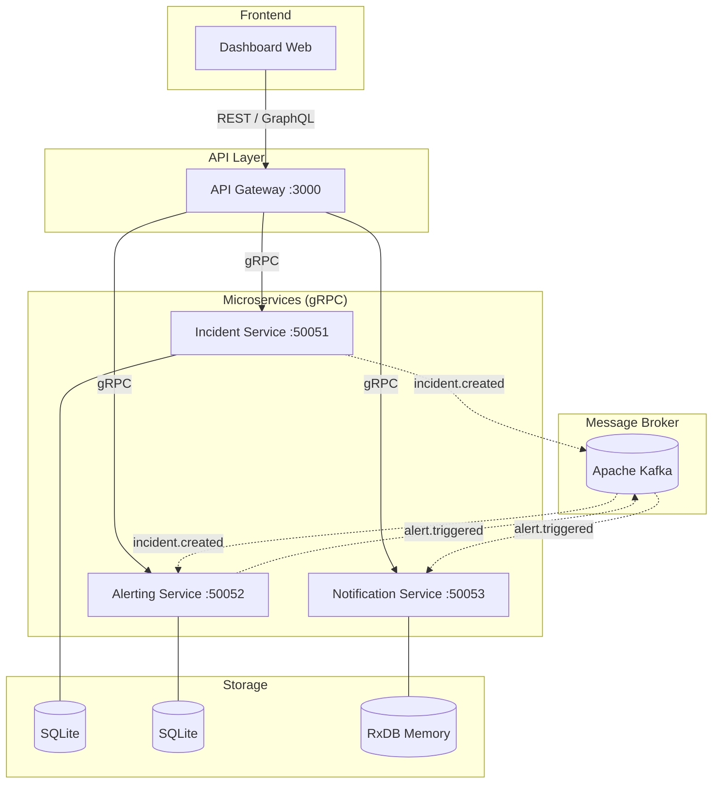

# IncidentOps - Plateforme de Gestion d'Incidents

IncidentOps est une application microservices robuste conçue pour la détection, le suivi et la notification d'incidents en temps réel. Elle utilise une architecture événementielle basée sur Kafka et une communication synchrone via gRPC.

## 🏗️ Schéma d'Architecture



## 🛠️ Stack Technique

- **Langage** : Node.js
- **Communication Inter-services** : gRPC (Protocol Buffers)
- **Message Broker** : Apache Kafka
- **Gateway** : Express (REST) & Apollo Server (GraphQL)
- **Bases de données** : SQLite (Incident/Alerting), RxDB (Notification)
- **Frontend** : Dashboard Vanilla JS/CSS

## 📡 Documentation des Endpoints REST (Gateway :3000)

| Méthode | Endpoint | Description |
| :--- | :--- | :--- |
| `GET` | `/health` | État de santé de la Gateway et des services |
| `GET` | `/api/incidents` | Liste tous les incidents |
| `POST` | `/api/incidents` | Crée un nouvel incident |
| `GET` | `/api/incidents/:id` | Détails d'un incident spécifique |
| `PATCH` | `/api/incidents/:id` | Met à jour un incident (sévérité, statut, assignation) |
| `POST` | `/api/incidents/:id/close` | Ferme un incident avec une résolution |
| `GET` | `/api/rules` | Liste les règles d'alerte configurées |
| `POST` | `/api/rules` | Crée une nouvelle règle d'alerte |
| `DELETE` | `/api/rules/:id` | Supprime une règle d'alerte |
| `GET` | `/api/alerts` | Liste les alertes déclenchées |
| `GET` | `/api/notifications` | Historique des notifications envoyées |
| `GET` | `/api/notifications/stats` | Statistiques globales des notifications |

## 📊 Schéma GraphQL

L'explorateur GraphQL est disponible sur `http://localhost:3000/graphql`.

### Queries principales
- `incidents(status: String)` : Liste filtrée des incidents.
- `incident(id: String!)` : Détail d'un incident.
- `incidentDashboard(id: String!)` : Vue unifiée regroupant l'incident, ses alertes et ses notifications.
- `notificationStats` : Statistiques d'envoi par canal (Slack, Email, SMS).

### Mutations principales
- `createIncident(...)` : Déclenche le flux de création.
- `createRule(...)` : Ajoute une logique de surveillance.
- `sendNotification(...)` : Envoi manuel d'une notification.

## 📨 Topics Kafka

Le système utilise trois topics principaux pour la communication asynchrone :

1.  **`incident.created`** :
    - Émis par : `incident-service`
    - Consommé par : `alerting-service`
    - Rôle : Informe qu'un nouvel incident doit être évalué par les règles d'alerte.

2.  **`alert.triggered`** :
    - Émis par : `alerting-service`
    - Consommé par : `notification-service`
    - Rôle : Indique qu'une règle a matché et qu'une notification doit être envoyée.

3.  **`notification.sent`** :
    - Émis par : `notification-service`
    - Rôle : Trace l'envoi effectif de la notification.

## 💾 Bases de Données

- **Incident Service** : SQLite (`incident-service/db/incidents.db`). Stocke les titres, descriptions et états.
- **Alerting Service** : SQLite (`alerting-service/db/alerting.db`). Stocke les règles et l'historique des alertes.
- **Notification Service** : RxDB (Stockage en mémoire). Stocke temporairement les logs de notifications envoyées.

## 🚀 Installation et Exécution

### Prérequis
- Node.js (v16+)
- Apache Kafka & Zookeeper (installés et configurés localement)

### 1. Démarrer Kafka (Windows)
```bash
# Terminal 1 : Zookeeper
bin\windows\zookeeper-server-start.bat config\zookeeper.properties

# Terminal 2 : Kafka
bin\windows\kafka-server-start.bat config\server.properties
```

### 2. Créer les Topics
```bash
bin\windows\kafka-topics.bat --create --bootstrap-server localhost:9092 --topic incident.created --partitions 1 --replication-factor 1
bin\windows\kafka-topics.bat --create --bootstrap-server localhost:9092 --topic alert.triggered --partitions 1 --replication-factor 1
bin\windows\kafka-topics.bat --create --bootstrap-server localhost:9092 --topic notification.sent --partitions 1 --replication-factor 1
```

### 3. Installer les dépendances
Exécutez `npm install` dans la racine et dans chaque dossier de service :
```bash
npm install
cd ApiGetway && npm install
cd ../incident-service && npm install
cd ../alerting-service && npm install
cd ../notification-service && npm install
```

### 4. Lancer les Services
Lancez chaque service dans un terminal séparé :
```bash
# Incident Service
cd incident-service && node index.js

# Alerting Service
cd alerting-service && node index.js

# Notification Service
cd notification-service && node index.js

# API Gateway
cd ApiGetway && node index.js
```

### 5. Accéder au Dashboard
Ouvrez simplement le fichier `dashboard/index.html` dans votre navigateur ou servez-le via un serveur HTTP local.
